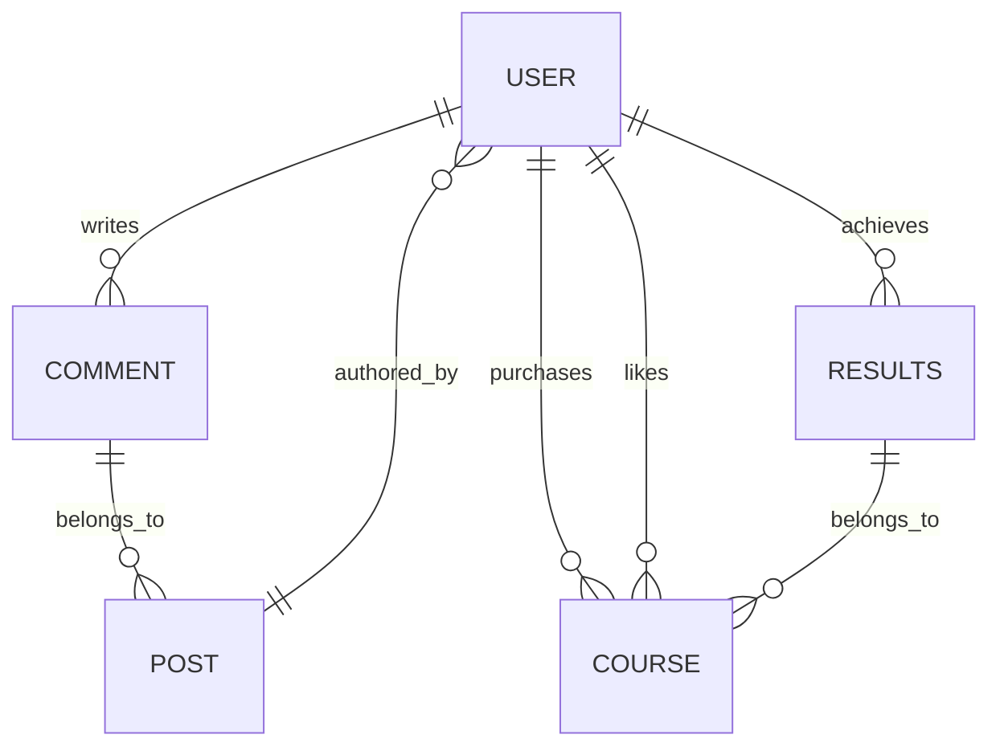

# ⚡ VoltStudy 📚

  [](https://opensource.org/licenses/MIT)

<br/>
<strong>🏠 Home Activity:</strong>
<br/>


<br/>

<div style="text-align: center;">
<strong>VoltStudy</strong> leverages a Java-based Android architecture with Firebase real-time database, authentication, and cloud storage for dynamic content delivery and user management. The app integrates Apache POI for document handling, ExoPlayer for multimedia playback, Glide for image optimization, and OkHttp for network communication. In-app billing is implemented for monetization, while Node.js Cloud Functions handle backend tasks like revenue calculation. Additional libraries enhance the user experience with features such as video compression, email support, toast notifications, image cropping, and PDF viewing. The app's scalable design facilitates future growth and feature enhancements.
</div>

<br/>

# 🚀 Features
- **Dynamic Course Content :**

	- <strong>Textual PDF Courses:</strong>
		 <br/>
		<br/>

	- <strong>Video Courses: </strong>
 		<br/>
		

<br/>
<br/>

- **Quizzes & Certification:**  Implemented gamification with section-wise quizzes.

<br/>

<table style="width: 100%; table-layout: fixed; border-collapse: separate; border-spacing: 20px;">
    <tr>
        <td style="text-align: center;">
            
            <br>
            <strong>Attempt quiz after each chapter</strong>
        </td>
        <td style="text-align: center;">
            
            <br>
            <strong>Complete before you run out of time</strong>
        </td>
                <td style="text-align: center;">
            
            <br>
            <strong>Score above 50% to unlock next chapter</strong>
        </td>
    </tr>
    <tr>
        <td style="text-align: center;">
            
            <br>
            <strong>Answer multiple choice questions in time</strong>
        </td>
        <td style="text-align: center;">
            
            <br>
            <strong>Know your right and  wrong answers to learn</strong>
        </td>
        <td style="text-align: center;">
            
            <br>
            <strong>Get your custom certificate after completing all quizzes</strong>
        </td>
    </tr>
</table>


<br/>
<br/>


- **In-App Purchases:** Users can purchase courses using Google's in-app billing:
<br/>


<br/>
<br/>

- **UI Components :**

	- <strong>Splash screen :</strong>
	<br/>
	
	<br/><br/>
    
	- <strong>Interactive animations :</strong>
	<br/>
	
	<br/><br/>

	- <strong>Save liked courses :</strong>
	<br/>
	
	<br/><br/>

	- <strong>Fluid Navigation :</strong>
	<br/>
	

<br/>
<br/>

- **User Authentication & Management :**

  

<table  style="width: 100%; table-layout: fixed; border-collapse: separate; border-spacing: 20px;">
<tr>
<td  style="text-align: center;">

<br>
<strong>Sign In</strong>
</td>
<td  style="text-align: center;">

<br>
<strong>Registration with Email OTP Verification</strong>
</td>
</tr>
<tr>
<td  colspan="2"></td>
</tr>
</table>

<br/>

<table>
<tr>
<td  style="text-align: center;">

<br>
<strong>View or update details</strong>
</td>
<td  style="text-align: center;">

<br>
<strong>Reset Password</strong>
</td>
</tr>
<tr>
<td  colspan="2"></td>
</tr>
</table>

<br/>
<br/>

  

- **Trainers Registration :**

<table>
<tr>
<td  style="text-align: center;">

<br>
<strong>Checks if user is a trainer</strong>
</td>
<td  style="text-align: center;">

<br>
<strong>Trainer E-mail before registration</strong>
</td>
</tr>
<tr>
<td  colspan="2"></td>
</tr>
</table>

<br/>

  

<table>
<tr>
<td  style="text-align: center;">

<br>
<strong>Trainer basic details form</strong>
</td>
 <td  style="text-align: center;">
 
<br>
<strong>Trainer academic background form</strong>
</td>
</tr>
<tr>
<td  colspan="2"></td>
</tr>
</table>

<br/>
<br/>

- **Trainer Admin Panel :**

<table  style="width: 100%; border-collapse: separate; border-spacing: 60px;">
<tr>
<td  style="width: 50%; text-align: center;">

<br>
<strong>Trainer Dashboard</strong>
</td>
<td  style="width: 50%; text-align: center;">

<br>
<strong>Set course details and thumbnail</strong>
</td>
</tr>
<tr>
<td  colspan="2"></td>
</tr>
</table>

<br/>

 <table  style="width: 100%; border-collapse: separate; border-spacing: 60px;">
<tr>
<td  style="width: 50%; text-align: center;">

<br>
<strong>Video preview before upload</strong>
</td>
<td  style="width: 50%; text-align: center;">

<br>
<strong>Automatic compressed upload</strong>
</td>
</tr>
<tr>
<td  colspan="2"></td>
</tr>
</table>

<br/>

<table  style="width: 100%; border-collapse: separate; border-spacing: 60px;">
<tr>
<td  style="width: 50%; text-align: center;">

<br>
<strong>Create Quizzes</strong>
</td>
<td  style="width: 50%; text-align: center;">

<br>
<strong>Set name and time limit</strong>
</td>
</tr>
<tr>
<td  colspan="2"></td>
</tr>
</table>

<br/>
<table  style="width: 100%; border-collapse: separate; border-spacing: 60px;">
<tr>
<td  style="width: 50%; text-align: center;">

<br>
<strong>PDF course upload</strong>
</td>
<td  style="width: 50%; text-align: center;">

<br>
<strong>Checks to help users</strong>
</td>
</tr>
<tr>
<td  colspan="2"></td></tr>
</table>

<br/>
<br/>

- **Course search filters :**


<br/>
<br/>

- **Community Interaction :**
		
	- <strong>Doubt Discussion :</strong>
	<br/>
			<br/>	<br/>

		
	- <strong>Like correct answers :</strong>
	<br/>
	

	<br/>
	<br/>

<table  style="width: 100%; border-collapse: separate; border-spacing: 60px;">
<tr>
<td  style="width: 50%; text-align: center;">

<br>
<strong>Ask questions with or without images</strong>
</td>
<td  style="width: 50%; text-align: center;">

<br>
<strong>Share with friends</strong>
</td>
</tr>
<tr>
<td  colspan="2"></td>
</tr>
</table>

<br/>

**Feedback & FAQs**

<table>
<tr>
<td  style="text-align: center;">

<br>
<strong>Share feedback with us</strong>
</td>
<td  style="text-align: center;">

<br>
<strong>Frequently asked questions</strong>
</td>
</tr>
<tr>
<td colspan="2"></td>
</tr>
</table>

<br/>

 **Additional Features**

  -  **Images, PDFs & Video compression:** Automatic compression of files during upload to ensure efficient data usage and storage.

-  **Trainer account moderation:**  Email is sent to super admin with TrainerID, their academic background and personal details for verification.
  
  -    **Course content moderation:** Email is sent to super admin with AuthorID, CourseID and other content for verification.

<br/>

  

# 🛠️ Setup & Deployment

  **1. Clone the repository:**

Begin by cloning the project repository to your local machine using the following command:

```
git clone https://github.com/vatsalcshah/VoltStudy
```
<br/>

> **Modify the `build.gradle` file (if needed):**

  

> After cloning, you might need to modify the `build.gradle` file to match older Gradle versions if you're having trouble with the app building. Check the official Android documentation or online resources for guidance on compatibility issues.

  
<br/>

**2. Set up Firebase:**

  - Create a Firebase project on the Firebase console ([https://console.firebase.google.com/](https://console.firebase.google.com/)).

  - In your Firebase project settings, add an Android app and provide your app's package name.

  -  **Download the `google-services.json` file generated by Firebase and replace it in your Android project's `app` module directory.**

<br/>
  
**3. Prepare the Firebase Realtime Database:**

  - Go to your Firebase Realtime Database and import the **dummy_firebase_realtime_database.json** file. This will populate your database with the initial data structure.

  - Set the security rules for your Realtime Database by uploading the **rules.txt** file. This ensures data integrity and security.

  > Modify rules.txt & json based on your requirements & data

  > You can refer my file **cloud_functions** to deploy node.js functions of your Firestore Cloud Functions.

  <br/>


**4. Configure In-App Billing:**

  - In the Google Play Console, set up in-app billing products for your app (if it offers premium features or content).

  - Obtain your app's license key from the Google Play Console and add it to your Android project's configuration files.

  -  **For testing purposes only**, you can set the `productID` variable in `CourseDetailActivity.java` to `android.test.purchased`. This allows you to simulate purchases without actually charging the user's account. Remember to revert this change before releasing your app to production.


  >  **Pro Tip:** Once you have completed the setup, use your code editor's global find and replace feature to quickly change any API links or endpoints to match your specific backend setup. This will streamline the customization process.

  
# 🔗 Database ER diagram


